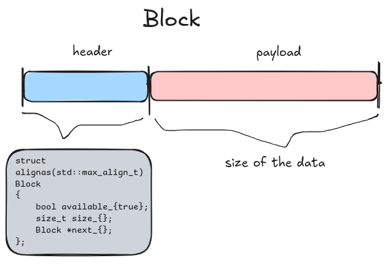

# C++ Memory Allocator

- Inspired by [salar's video](https://www.youtube.com/watch?v=H8vCBFX62Qg)

.png>)



- We can see that the size of `struct Block` is 24 bytes by default based on the members of the object. This would not change regardless of how we order the members because of the way padding works in C++.
- But we have to align it in memory (`alignas()`) so that it can support any type (`std::max_align_t`), which would round up the size of `struct Block` to 32 bytes.

## Compiling + Running the Program

```bash
cmake -B build
cmake --build build
./build/heap
```

## Potential Future Improvements

- add attribute to block with field: memory address
- add multithreading, mutex
- give each cpu its own space to allocate

## Limitations

- I decided against implementing it using classes/ OOP because there's no need to implement the rule of 5.

- Allocation happens in $O(N)$ time. We could make it happen in $O(1)$ time if we use a method called binning/ bucketing.
